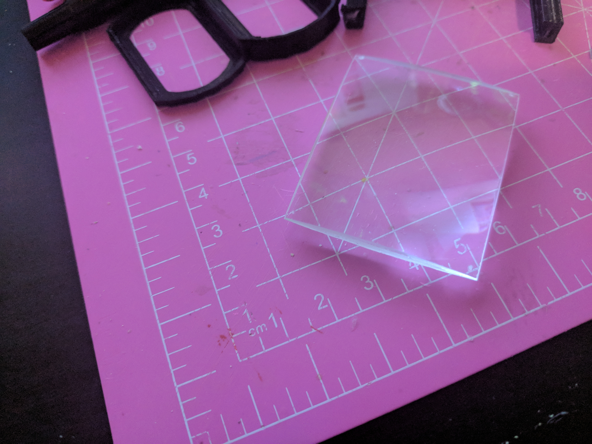
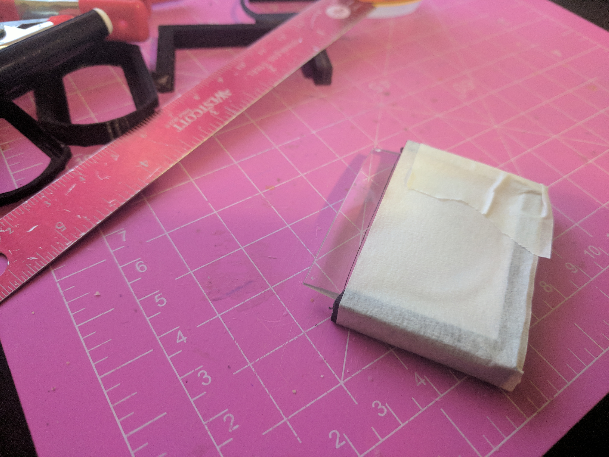
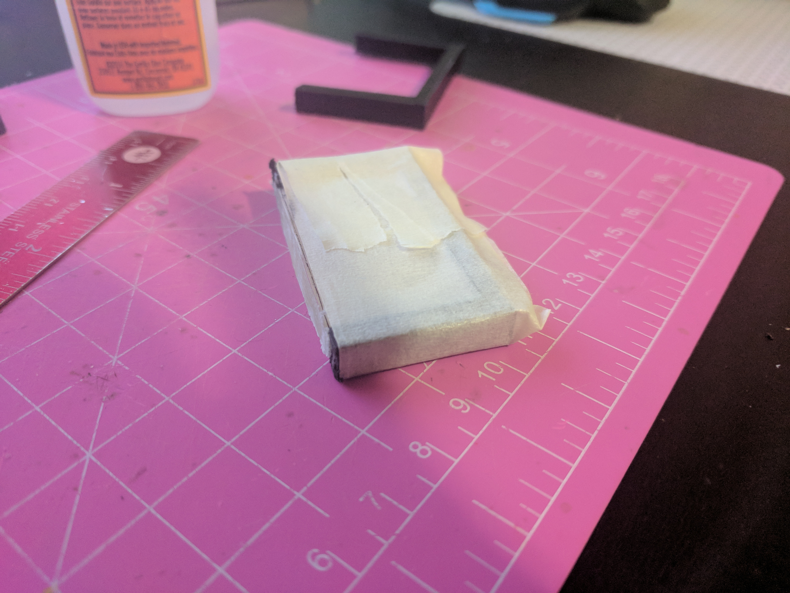
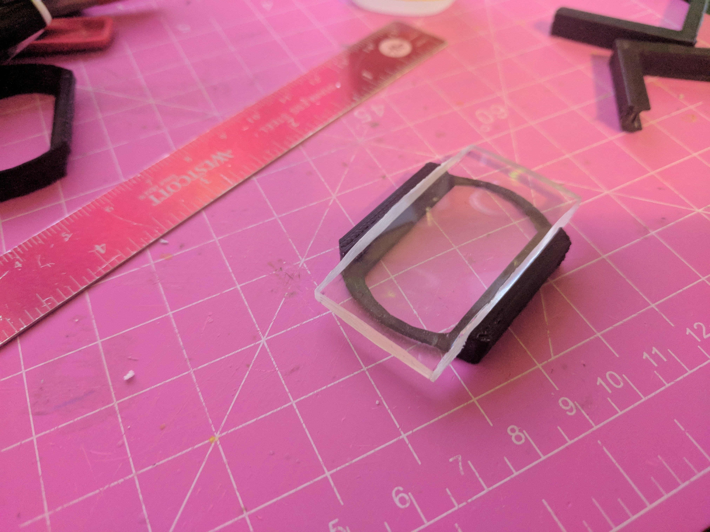
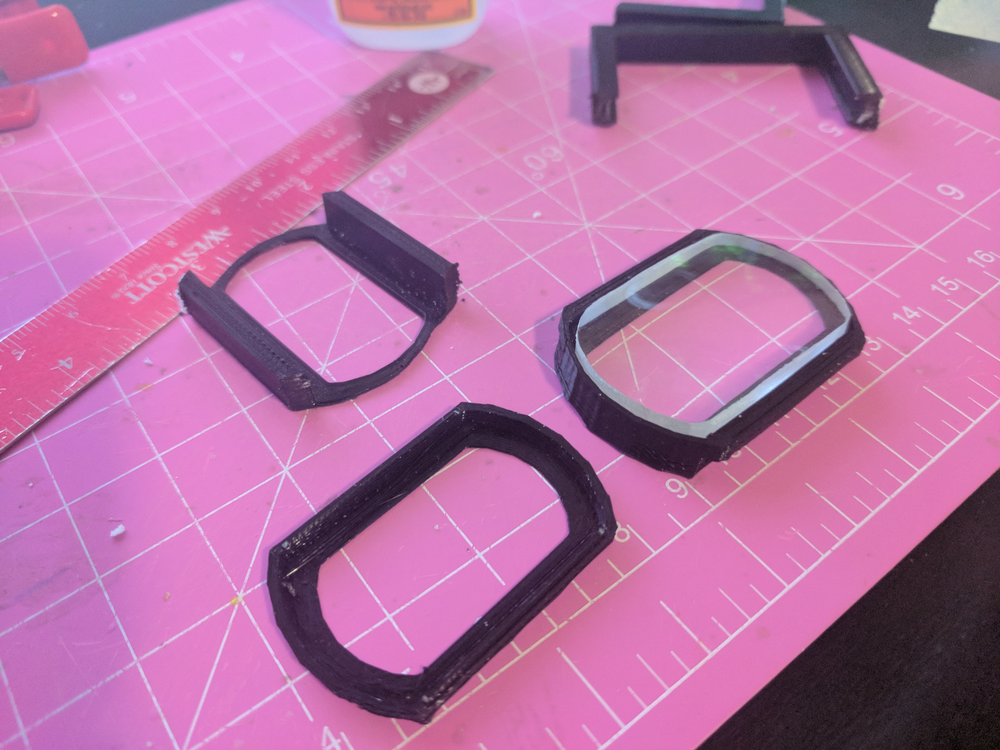
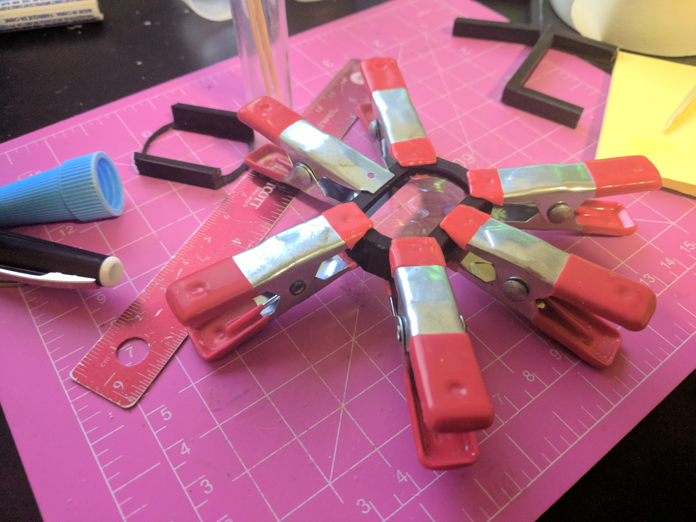

# Lens Assembly

This document explains how to make the lens part of the otoscope.

You will need the following:

* Printed parts:
  * Lens holder (large)
  * Lens holder (small)
  * Jig parts #1, #2 and #3

* Other parts:
  * One lens, 3x magnification (example: [amazon](https://www.amazon.com/Advanced-Magnifier-Magnification-Handheld-Magnifying))
  * Cyanoacrylate glue ([amazon](https://www.amazon.ca/Gorilla-7805201-20g-Super-Glue))
  * Clamps ([amazon](https://www.amazon.ca/TEKTON-3901-4-Inch-Opening-10-Piece))

## Step 1
Shave down the lens so that all edges are straight with no protrusions. You can use a rotary tool or other cutter for this.

## Step 2
Place the lens in printed jig #1. While the lens is in the jig, draw a straight cut line from the tops of jig. Secure the lens with masking tape.

Cut off excess lens above the line using a rotary cutting tool, grinder or belt sander.

## Step 3
Take lens out of jig #1 and place into jig #2. **Ensure that previously smoothed side is not cut again so as to ensure the correct focal point.**

Draw a straight line from tops of jig. Secure with masking tape. Cut off excess lens above the line.

## Step 4

Place lens in centered fashion in jig #3 and secure with masking tape. Cut off excess lens while shaping it to the jig.

## Step 5
Place lens in the large lens holder piece. Some parts of the lens may need to be further cut or ground to achieve a secure fit.

## Step 6
Dry fit with the smaller lens holder piece. 

## Step 7
Glue the two parts together. If using cyanoacrylate glue, ensure that none touches the lens. If it does, wipe away immediately, as any glue on the lens will ruin it. Clamp parts together until bonded.

